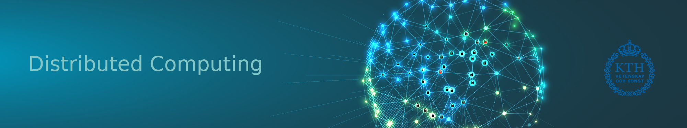

# The Course Title
Reading Course on "Advanced Topics in Distributed Systems and Data Mining"

---
# The Course Content

This course is a graduate reading course that will cover the advanced topics in distributed systems, including but not limited to distributed learning, gossip-based learning, graph neural networks, and large scale graph processing. Every participant should find their own relevant research papers, read and analyze their contributions, give a presentation on the material and actively contribute to the group discussions, as well as write a short report on the selected papers. This course is given in the distributed computing group at KTH (<a href="https://dcatkth.github.io/">DC@KTH</a>).

---
# Intended Learning Outcomes (ILO)

After the course the student will be able to discuss, analyze, present, and critically review the very latest research advancements in the areas of distributed systems and learning and make connections to knowledge in related fields. The student will also be able to assess and evaluate new emerging trends as well as to identify the need for further knowledge in the field.

---
# Course Disposition

The course is organized as a reading course. Each student will be required to perform the following tasks:
<ul>
<li>
<b>Task 1:</b> identity your relevant research literature under the topic of distirbuted systems, with a focus on distributed learning, gossip-based learning, graph neural networks, large scale graph processing, or similar. Scan the related literature and select three papers that you would like to review. It would be better that the papers tackle the same problem, or are related to the application of the same discipline/approach to different problems. The key point to observe is that the selected papers share some common ground based on which they could be compared against each other.
</li>
<li>
<b>Task 2:</b> write a short justification paragraph to explain your choice of the selected papers. Note that, at this stage, you are not required to read the papers in detail. The paragraph should mostly focus on why you are more interested in the selected focused topic, and how you think your selected papers relate to it (e.g., they address the same research question, they apply different approaches to the same problem).</li>
<li>
<b>Task 3:</b> carefully read, analyze, and compare the selected papers to prepare an oral presentation. The presentation should not only present what is in the papers, but mostly contrast and compare their approaches, contributions, and shortcomings, possibly getting/giving insights on related future research. The presentation should be delivered during one of our regular seminar sessions.</li>
<li>
<b>Task 4:</b> write a critical review of the papers that covers in particular the summary of contributions, solutions, significance, and technical/experimental quality.</li>
<li>
<b>Task 5:</b> choose one of your peers presentations to oppose. You will need to read the papers as well and have a general understanding of their content, contributions, and possible noticed limitations. You have to attend the presentation of your opponent, and to take careful notes on how you perceived its quality, both in terms of content, suitability of the chosen papers and the links between them, and quality of presenting.</li>
<li>
<b>Task 6:</b> deliver a written report reviewing your opponent’s work. The review should present objective arguments on what you think are the strengths and weaknesses of the opposed presentation. The report should clearly explain why or why not you think that the selected papers fit within the course’s topic, how the presentation has been fair to explaining the content of the papers, as well as what were the presentations strong points and possible shortcomings.</li>
<li>
<b>Task 7:</b> a minimum of 75% attendance in seminars.</li>
</ul>

# Papers and Schedule
#### <a href="mailto:klasseg@kth.se">Klas Segeljakt</a> [slides]
* Structured Streaming: A Declarative API for Real-Time Applications in Apache Spark [[pdf](/papers/Consistent%20Regions:%20Guaranteed%20Tuple%20Processing%20in%20IBM%20Streams.pdf)]
* State Management in Apache Flink [[pdf](/papers/State%20Management%20in%20Apache%20Flink.pdf)]
* Consistent Regions: Guaranteed Tuple Processing in IBM Streams [[pdf](/papers/Structured%20Streaming:%20A%20Declarative%20API%20for%20Real-Time%20Applications%20in%20Apache%20Spark.pdf)]

#### <a href="mailto:lodovico@kth.se">Lodovico Giaretta</a> [slides]
* Gated Graph Sequence Neural Networks [[pdf](/papers/Gated%20Graph%20Sequence%20Neural%20Networks.pdf)]
* Semi-Supervised Classification with Graph Convolutional Networks [[pdf](/papers/Semi-Supervised%20Classification%20with%20Graph%20Convolutional%20Networks.pdf)]
* Inductive Representation Learning on Large Graphs [[pdf](/papers/Inductive%20Representation%20Learning%20on%20Large%20Graphs.pdf)]

---
# Contact
Contact [Amir H. Payberah](https://payberah.github.io/) if you have any question.

<!--
# Enrollment
Those who are interested in registering for this course and gaining credits, please make sure to have your name on the following list before September 30, 2019: [link](https://docs.google.com/spreadsheets/d/1dLaYwNC9rXUTi-UcTtT_07dEMjo5xVUVvZ25G1v1Pz4/edit?usp=sharing)
-->
